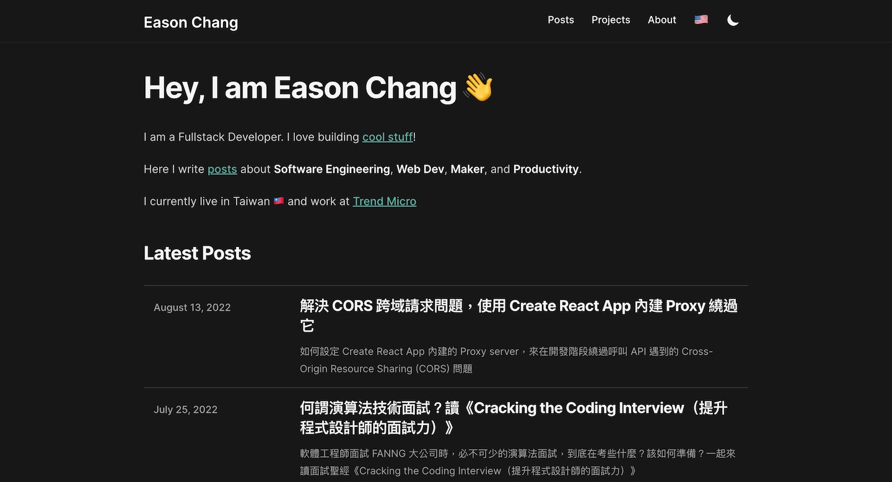

# easonchang.com-next



Eason Chang's brand new personal blog

Visit: [https://easonchang.com/](https://easonchang.com/)

## Features

- Next.js 12
- ContentLayer (loading local MDX files)
- TailwindCSS
- Atomic design project structure
- Storybook
- Absolute import
- Hygen as code generator
- Eslint, Prettier
- Husky, lint-staged pre-commit hook
- `pnpm` as package manager

## Commands

### Start local dev server

```bash
pnpm dev
```

Open [http://localhost:3000](http://localhost:3000) with your browser to see the result.

### Start Storybook component dev environment

```bash
pnpm storybook
```

This command will open [http://localhost:6006](http://localhost:6006) for you, this is where you can see storybook

### Generate new component scaffold

```bash
pnpm new-component
```

This calls hygen to generate new component with basic file structures, including its JS file and stories.js file

You will be prompted to select component type (atoms, molecules, organisms, templates), and then input component name

### Generate new post

```bash
pnpm new-post
```
